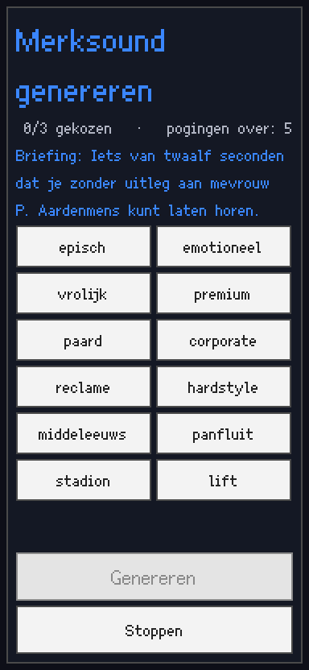
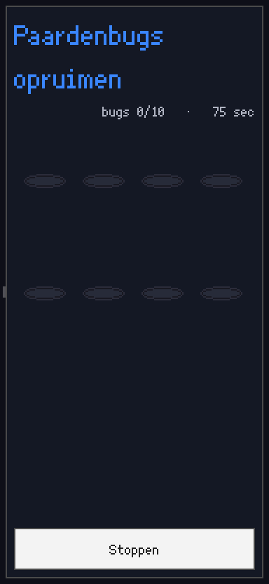
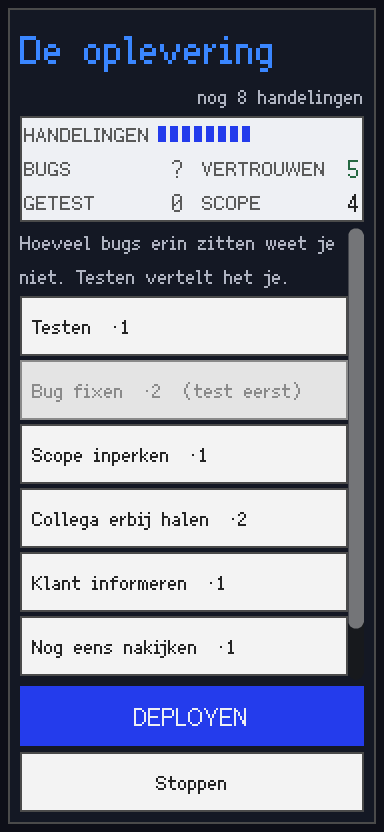
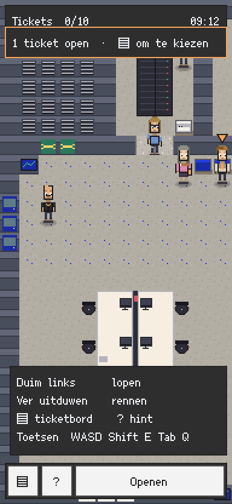
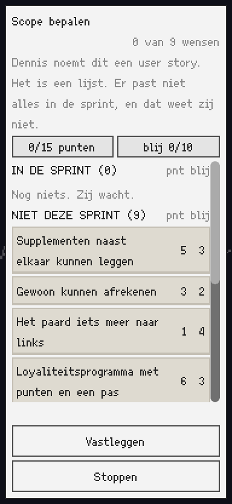
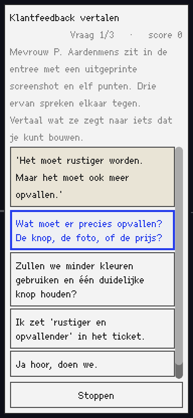
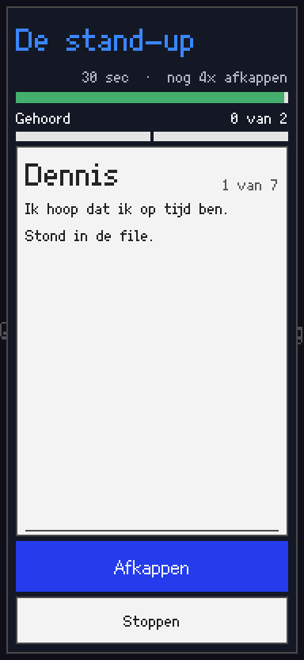
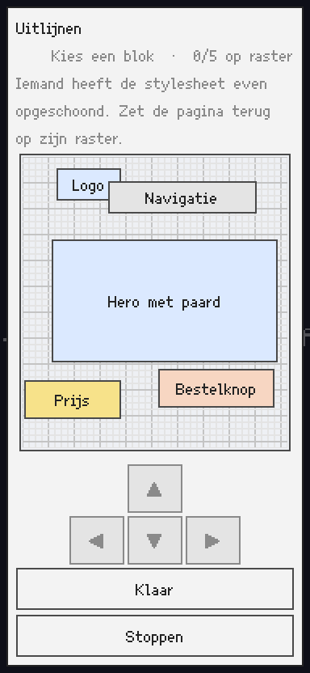
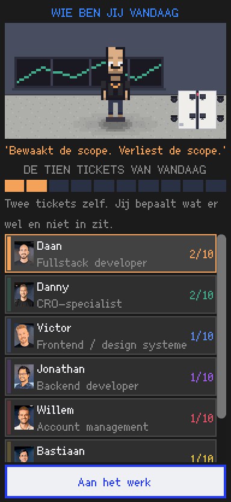

# 10 Tickets naar Vrijheid — Speelaudit

**Datum:** 2 september 2026 · **Engine:** Godot 4.7.2 · **Build:** werkboom, 150 ongecommitte paden
**Vraag:** is dit spel leuk, begrijpelijk en samenhangend voor een casual speler — of ligt de oorspronkelijke essentie begraven onder wat er sindsdien bovenop is gebouwd?

Dit is een **auditfase**. Er is niets herbouwd, niets toegevoegd, niets gerefactored.

## Methode en bewijslast

| Bron | Wat |
| --- | --- |
| Statisch | Alle 62 `.gd`-bestanden, 20 scenes, 22 databestanden gelezen |
| Testsuite | `res://tests/test_runner.tscn` headless — **16.658 controles, 0 fout** |
| Echte doorloop | `--playthrough --autoplay` als daan/victor/willem/koen — **10/10 gehaald, 4×** |
| Visuele inspectie | 20 frames uit de eigen QA-harnas (`--minigame=` + `--shot=`), alle 11 minigames + shell-schermen |
| Specialisten | 4 parallelle deelaudits: minigames, dialoog/narratief, wereld/pacing, UI/mobiel |

Loopafstanden zijn 8-richtings Dijkstra over het echte begaanbare raster uit `data/floor.json`, gedeeld door `WALK_SPEED = 96.0` px/s ([player.gd:7](../scripts/entities/player.gd)). Pixelmaten zijn canvaspixels (192×416), gemeten op gerenderde frames, niet geschat.

**Eén correctie op mijn eigen eerste meting:** `--playthrough` zonder `--autoplay` loopt vast op BBD-201. Dat is de harnas die geen dialoog kan doorklikken, geen spelbug. Met beide vlaggen haalt elk personage 10/10.

---

# A. Managementsamenvatting

## Is het spel fundamenteel leuk?

**Het spel is fundamenteel goed geschreven en fundamenteel niet leuk om te spelen.** Dat zijn twee losse dingen en ze staan hier ver uit elkaar.

De fictie werkt. Een stand-up van 45 seconden in een slot van 42. Een user story die een lijst is. Een merksound die niemand wil maar die in Jira staat. Een urenstaat die je moet invullen voordat je naar huis mag. Een klant die je 's avonds over een paard sms't. Dat is precies "een chaotische, grappige en verrassend geloofwaardige werkdag".

De *speelbeurt* werkt niet, om één reden: **de dag is geen dag maar negen losstaande boodschappen.** Negen van de tien tickets hebben `available_when: {}`, `requirements: {}` en `unlocks: []`. Alle negen staan open vanaf seconde één, geen enkel ticket ontsluit, wijzigt of herprioriteert een ander. De motor kán het wel — `unlock_ticket`, `available_when` en `requirements` zijn alle drie geïmplementeerd en getest — maar de content gebruikt het bij precies één ticket (t10).

## Tien bevindingen

1. **Het spel schrijft een save en leest hem nooit terug.** `Session.load_from_disk()` bestaat ([session.gd:330](../autoload/session.gd)) en heeft **nul aanroepers**. `save_to_disk()` wordt bij elk ticket en bij achtergrondgang aangeroepen. Het titelscherm biedt alleen "Beginnen" en "Afsluiten". Op een telefoon is een run van 30–45 minuten onherstelbaar kwijt, terwijl de save al op schijf staat.
2. **Twee van de tien tickets eindigen in een kapot scherm.** BBD-207 rendert twaalf onleesbare verticale streepjes waar de te kiezen tags moeten staan. BBD-209 loopt aan beide kanten van het scherm af, titel en intro afgekapt. Beide zijn eenregelige geometriefouten.
3. **De dag heeft geen afhankelijkheden.** Zie hierboven. Dit is de kern van "lijst quests" in plaats van "werkdag".
4. **Een ticket oplossen verandert bijna niets.** 21 van de 24 `world_changes` zijn cosmetisch. Zes items en drie vlaggen worden uitgedeeld en door geen enkele regel code gelezen.
5. **Zes van de elf minigames hebben geen enkel gevolg.** `Gevolgen.GETALLEN` leest vijf minigames uit. De rest verdwijnt.
6. **De keuzes zijn decoratief.** 12 van 299 dialoognodes bieden een keuze, één daarvan ligt op het kritieke pad, en die schrijft twee vlaggen die nergens gelezen worden.
7. **De finale is het rustigste moment van het spel.** Mechanisch de beste minigame, emotioneel het vlakst: geen tijdsdruk, geen gelijktijdigheid, en falen is per ontwerp onmogelijk.
8. **Er is geen richtingaanwijzing.** In 6 van de 11 trajecten loop je naar een doel dat buiten beeld ligt, zonder marker. De openingszet is 8,6 seconden lopen naar iets 48 tegels verderop.
9. **Er is geen visuele hiërarchie.** Elk teken in het spel is 10 px. Er is één knopstijl voor "start het spel", "sluit af", "stop de minigame" en elke dialoogkeuze. `ORANJE` betekent vier verschillende dingen.
10. **De personagekeuze is een naamplaatje.** Het dominante idioom is dezelfde zin onder een andere naam. En vijf van de zeven personages hebben twee verschillende functietitels.

## Sterkste kwaliteit

De **wereld en de tekst**. De plattegrond is leesbaar en charmant, de zeven ruimtes hebben karakter, de pixelart is consistent, en de schrijfstijl is scherp en droog zonder één keer te knipogen. `data/dialogue/` en `data/minigame_content.json` zijn het beste materiaal in het project.

Daarnaast: de **techniek is niet het probleem**. `QuestEngine`, `Gevolgen`, `TraitModifier` en `Briefing` zijn zorgvuldig, statisch, headless testbaar en goed gedocumenteerd. Een testsuite van 16.658 controles die groen staat is geen normale hobbystandaard.

## Waar gaat de essentie verloren?

Op het moment dat een geloofwaardig kantoorprobleem verandert in **een afgesloten puzzelscherm waar de wereld buiten stilstaat**. `Shell.run_minigame()` zet `get_tree().paused = true`. De chaos van het kantoor stopt letterlijk zodra je aan het werk gaat. Elk ticket is: chaos → pauze → puzzel → één label verandert → chaos → pauze → puzzel.

De brief vraagt "de situatie moet chaotisch zijn, de besturing begrijpelijk". Wat er staat is het omgekeerde: **de situatie is rustig en de interface is chaotisch.**

## Wat moet blijven

De wereld, de plattegrond, de schrijfstijl, de urenstaat als idee, `Gevolgen`/`finale_start()`, de briefing/trait-symmetrie, de stand-up, de scope-minigame, het personagekeuzescherm, en de klanttelefoon als kanaal.

## Wat kan weg

Vier minigames, negen `recruit`-dialoogbomen, 1.853 woorden collega-praat buiten het kritieke pad, 26 dode vlaggen, 6 dode items, en de aanname dat elk ticket een eigen mechaniek nodig heeft.

## Wat vraagt structurele verandering

De ticketstroom (afhankelijkheden), het pauzemodel van de minigames, de navigatie, en de finale-opvoering.

---

# B. Verdict op de kernlus

## Huidige lus

```
ruimte binnenlopen  →  ticket verschijnt in je inventaris
                    →  is het niet jouw vak: lopen naar de eigenaar (5–11 s)
                    →  3 dialoognodes, hij loopt mee
                    →  terug lopen naar het anker (idem)
                    →  ~11 dialoogregels doorklikken
                    →  afgesloten puzzelscherm, wereld op pause
                    →  toast + één label op een prop verandert + camera pant 1,4 s
                    →  ×10
```

Gemeten: 10 tickets, 66,9 s lopen in ticketvolgorde, 96–102 s met de ophaalomlopen, ~1.026 woorden ticketdialoog, ~127 tikken om door te klikken.

## Bedoelde lus

Uit de brief en uit `docs/GAME_DESIGN.md`:

```
OBSERVEREN → BEGRIJPEN → KIEZEN → HANDELEN → GEVOLG → NIEUWE INFORMATIE → OBSERVEREN
```

## Het gat

De lus loopt tot **HANDELEN** en breekt daarna in drieën:

| Schakel | Status | Bewijs |
| --- | --- | --- |
| OBSERVEREN | **werkt** | `discover_in_zone()` — een ruimte binnenlopen levert werk op. Dit is het beste idee in het spel. |
| BEGRIJPEN | **half** | De briefing van de eigenaar geeft één waar feit, geïnterpoleerd uit de echte config. Sterk. Maar hij is gezichtsloos (`say()` geeft nooit een portret mee) en verdwijnt na één tik. |
| KIEZEN | **ontbreekt** | Alle negen tickets staan altijd open. "Kiezen" is kiezen in welke volgorde je negen identieke boodschappen doet. Er is geen reden om A vóór B te doen. |
| HANDELEN | **werkt** | De minigames zijn speelbaar (op twee kapotte na). |
| GEVOLG | **half** | 5 van 11 minigames voeden `Gevolgen`. De andere 6 verdampen. |
| NIEUWE INFORMATIE | **ontbreekt** | Geen enkel ticket ontsluit een ander. De klant kan geen taak aanmaken of wijzigen. `Bus.klant_bericht` heeft één luisteraar en dat is een QA-teller. |
| → OBSERVEREN | **gebroken** | Je komt nooit terug bij observeren met nieuwe kennis, want er is geen nieuwe kennis. |

**Conclusie:** het spel is op dit moment `OPEN TICKET → MINIGAME → KLAAR → VOLGEND TICKET`. Dat is precies het faalpatroon uit §7 van de brief, en het is aantoonbaar in de data, niet een kwestie van smaak.

Het scherpste bewijs: **de ticketvolgorde kost twee keer zoveel lopen als de optimale volgorde** (66,9 s tegen 33,7 s). De nummering 1–10 zigzagt vier keer over de vloer terwijl de optimale route simpelweg west-naar-oost is. Dat de nummering vrij mag zigzaggen zonder dat iets breekt, is het bewijs dat de volgorde niets betekent.

---

# C. Top 10 speelproblemen

### 1 · P0 — Het spel bewaart je dag en leest hem nooit terug

**Bewijs.** `Session.load_from_disk()` ([session.gd:330](../autoload/session.gd)) heeft nul aanroepers in het hele project. `save_to_disk()` wordt aangeroepen bij elk voltooid ticket ([quest_engine.gd:159](../scripts/core/quest_engine.gd)) en bij achtergrondgang ([shell.gd:65](../autoload/shell.gd)) — met een comment dat uitlegt dat Android het proces zonder waarschuwing mag killen. Het titelscherm bouwt precies twee knoppen: `Beginnen` en `Afsluiten` ([title_screen.gd:35-41](../scripts/ui/title_screen.gd)).

**Spelerimpact.** Een casual mobiele speler wordt gebeld, of Android reclaimt de app. De hele werkdag is weg. Er is geen pauzemenu, geen instellingen, geen volumeregeling en geen manier om een run te verlaten behalve hem afmaken of de app killen.

**Grondoorzaak.** De laadkant is gebouwd en nooit aangesloten. Dit is de "halve migratie" die `docs/ARCHITECTURE.md` zelf verbiedt.

**Richting.** Aansluiten en een derde knop. Dit is de goedkoopste grote winst in het hele rapport.

### 2 · P0 — Twee van de tien tickets eindigen in een onbruikbaar scherm

**BBD-207 (Merksound, `mg_tagpicker`).** De speler krijgt "Kies drie tags" en kan geen enkele tag lezen.



Grondoorzaak, volledig getraceerd: de chips worden gebouwd met `UiKit.keuzeknop()`, de knop die bedoeld is voor een schermbrede keuzelijst en daarom `custom_minimum_size = Vector2(94, 22)` zet ([ui_kit.gd:187](../scripts/ui/ui_kit.gd)). Daarna overschrijft `mg_tagpicker.gd:41` dat met `Vector2(0, 18)` en gooit de minimumbreedte weg. `keuzeknop` heeft autowrap aan, en `ui_kit.gd:129-130` documenteert expliciet dat *een Button met autowrap zijn tekstbreedte niet als minimum meldt*. Twaalf knoppen met minimumbreedte 0 in een `HFlowContainer` → alle twaalf op één regel, elk ~13 px, tekst weggeklipt. De enige leesbare chip is degene die naar de tweede regel wrapte: `lift` — en dat is een van de vijf valstrik-tags.

**BBD-209 (Paardenbugs, `mg_whack`).** De inhoud is breder dan de telefoon.



Grondoorzaak, met rekenwerk: `GridContainer`, `columns = 4`, `h_separation = 26`, gaten 34 px breed ([mg_whack.gd:100-102, :23](../scripts/minigames/mg_whack.gd)). Breedte = 4×34 + 3×26 = **214 px** in een canvas van **192 px**. Met `SIZE_SHRINK_CENTER` loopt het aan beide kanten ~11 px over, en het duwt het hele frame links van x=0 — vandaar de afgekapte titel "ardenbugs opruimen". Bevestigd op een venster van 768 px breed: de klipping blijft, want het spel letterboxt naar 192×416 ongeacht de vensterbreedte.

**Spelerimpact.** BBD-207 is niet oplosbaar door lezen, alleen door gokken. BBD-209 leest als een kapot spel.

### 3 · P1 — De dag heeft geen afhankelijkheden

**Bewijs.** Alle tien de ticketbestanden, geverifieerd: t01–t09 hebben `available_when: {}`, `requirements: {}` en `unlocks: []`. Alleen t10 heeft `{"min_tickets_done": 9}` en `{"has_item": ["deploysleutel"]}`. `QuestEngine.run_effects()` implementeert `unlock_ticket` ([quest_engine.gd:294](../scripts/core/quest_engine.gd)) en geen enkel ticket gebruikt het. Er is nergens fysieke poortwerking: `set_locked` staat één keer in de data en zet `voordeur` op `false`, wat een no-op is omdat `_locked` al `false` is.

**Spelerimpact.** Er is nooit een reden om iets vóór iets anders te doen, dus er is nooit een beslissing. De speler kan niet fout kiezen, niet slim kiezen, en niet ontdekken dat A eerst moest.

**Grondoorzaak.** Historisch: er stond eerder een keten en die is bewust opengezet ("nu alles tegelijk openstaat" komt drie keer voor in de comments). De vrijheid is gewonnen door de structuur weg te halen in plaats van te vervangen.

**Richting.** `unlocks` is er al. Eén afhankelijkheid per ticket, narratief gemotiveerd, kost nul nieuwe code — alleen data. De brief zegt het zelf: tickets mogen terugvallen naar TO DO, en nieuwe taken mogen bekend worden terwijl de wereld zich ontwikkelt. Beide zijn met de bestaande motor te bouwen.

### 4 · P1 — Een ticket oplossen verandert bijna niets

**Bewijs.** Alle 24 `world_changes` over de tien tickets geteld:

| op | aantal | soort |
| --- | --- | --- |
| `set_text` | 10 | prop met tekst erop |
| `camera_focus` | 8 | presentatie |
| `set_modulate` | 2 | kleur |
| `spawn_npc` | 1 | **voegt iets toe** |
| `despawn_npc` | 1 | haalt iets weg |
| `set_ambience` | 1 | muziek |
| `set_locked` | 1 | **no-op** |

**21 van 24 is cosmetisch.** De enige op in het hele spel die een nieuwe mogelijkheid toevoegt is `spawn_npc bezorger` na t08.

Erger: de twee `set_modulate`-ops (t05 serverrack groen, t06 dashboard groen) doen visueel niets. `WorldObject` krijgt nooit een `Sprite`-kind, dus `_sprite` is altijd `null` ([world_object.gd:14](../scripts/world/world_object.gd)) en `set_modulate` tint alleen het tekstlabel dat `set_text` één op eerder heeft aangemaakt. De twee momenten waarop de wereld zichtbaar geneest, gebeuren niet.

Daarnaast dood beloningsmateriaal: `frontend_ok`, `backend_ok`, `cro_ok` worden gezet en door geen regel gelezen. De items `user_story`, `planning`, `klantfeedback`, `productdata`, `audiobestand`, `videobestand` worden uitgedeeld — met prachtige beschrijvingen in `data/items.json` — en door niets gevraagd. `laptop`, `koffiebeker`, `toegangspas`, `figma_link`, `hdmi`, `usb_stick` worden nooit uitgedeeld. **6 van 13 items zijn dode data.**

**Spelerimpact.** De vloer is bij 10/10 mechanisch identiek aan 0/10. Het antwoord op "doet mijn handeling iets?" is: er verandert een woord op een schermpje en de camera kijkt er 1,4 seconde naar.

### 5 · P1 — Zes van de elf minigames hebben geen enkel gevolg

**Bewijs.** `Gevolgen.GETALLEN`/`match` leest uit: `mg_user_story`, `mg_cro`, `mg_video`, `mg_planning`, `mg_frontend_fix`, plus `mg_deploy` als eindtekst ([gevolgen.gd:38-113](../scripts/core/gevolgen.gd)). Niet gelezen: `mg_klantfeedback`, `mg_backend_fix`, `mg_muziek`, `mg_paarden`, `mg_urenstaat`.

**Spelerimpact.** Vijf van de tien tickets kun je slecht doen zonder dat de dag het merkt. Dat ondermijnt de vijf die het wél doen, want de speler kan het patroon niet leren.

**Waardering waar die hoort:** het systeem dat er is, is goed. `finale_start()` telt negen `gevolg_*`-vlaggen op tot `bugs`/`vertrouwen`/`getest`/`scope` en die vier getallen zijn letterlijk de begintoestand van de finale. Een zorgvuldige dag start met andere cijfers dan een slordige. Dat is echte accumulatie, niet een scorebord.

### 6 · P1 — De keuzes zijn decoratief

**Bewijs.** 299 dialoognodes, **12 met een keuze — 4,0 %**. Daarvan ligt er **één** op het kritieke pad van een ticket (`t03_offer/punten`). Negen van de twaalf convergeren binnen 1–3 nodes op één gedeelde node; de mediane takafwijking is **één node**. 26 vlaggen worden door keuze-effecten gezet; **nul** daarvan wordt door code gelezen, 24 alleen door de dialoogvarianten van dezelfde NPC. De twee vlaggen van de enige echte in-ticket-keuze — `klant_prioriteit` en `klant_echtgenoot` — worden nergens gelezen.

Van de zes `dialogue_outcome`s wordt er één geconsumeerd: `if uitkomst == &"boeken"` opent de urenstaat. De drie uitkomsten van Dennis worden berekend, over de bus gestuurd en weggegooid.

**Spelerimpact.** De speler die iets kiest krijgt een andere zin en dezelfde dag.

### 7 · P1 — De finale is het rustigste moment van het spel



**Bewijs.** De finale is mechanisch de beste minigame in het project: het aantal bugs is verborgen, `Testen` onthult het, `Bug fixen` is gepoort achter `vereist_getest: 1`, sommige handelingen zijn eenmalig, en bij zes bestede handelingen voegt een gescript incident een bug toe. Er is geen enkel juist antwoord. De begintoestand komt uit je hele dag.

En dan: het is één statisch scherm met vier getallen en zeven tekstknoppen. **Geen klok. Geen gelijktijdigheid. Geen onderbreking.** Falen is per ontwerp onmogelijk — `mg_oplevering.gd:3-5` zegt het zelf: *"elke uitkomst heet OPGELEVERD... `finish_with_banner()` gaat altijd met `ok = true` de deur uit."*

**Spelerimpact.** De brief vraagt "oh god, alles gebeurt tegelijk". Wat er staat is een rustige, turn-based optimalisatiepuzzel op het meest climactische moment van het spel. Het is het meest cerebrale scherm op de plek waar het minst nagedacht en het meest gevoeld moet worden.

**Grondoorzaak.** De opvoering, niet de mechaniek. De beslissingsruimte is precies goed; er staat alleen geen druk op.

### 8 · P2 — Er is geen richtingaanwijzing, en de hint is onleesbaar

**Bewijs.** De camera is een horizontale volger, `zoom` wordt nooit gezet, dus het beeld is 192×416 wereldpixels = **12 van 130 tegels breed, 9,2 % van de vloer**. Verticaal staat de hele vloer altijd in beeld: het is een 1D-corridor met een venster van 12 kolommen. Vooruitblik is `14.0` px — 0,875 tegel.

`ObjectiveMarker` is een oranje driehoek van 8 px die als `Node2D` aan het doel hangt, met **nul off-screen-behandeling** — geen randklemming, geen pijl, geen afstand. In 6 van de 11 trajecten in ticketvolgorde ligt het doel bij het begin van het traject buiten beeld, in 4 daarvan meer dan 20 tegels. **De openingszet van het spel is 8,6 seconden lopen naar iets 48 tegels buiten beeld.**

De vangnetten zijn allebei tekst. De doelregel in de HUD noemt een ruimte*naam*, nooit een richting, en drukt de zone twee keer af: `Nu: BBD-204 · De Vloer · Haal Victor uit De Vloer`. De hinttoast is de enige plek met echte informatie, en die van t10 — de enige plek waar staat waar de deploysleutel ligt — is **184 tekens over 6 regels, 2,6 seconden zichtbaar plus 0,5 s fade**. Nederlands leest op ~15–20 tekens/s; dit vraagt 9–12 s. De toast valt ook automatisch na 45 s zonder voortgang, dus de speler die vastzit krijgt hem opnieuw en kan hem opnieuw niet lezen.

**Spelerimpact.** Wayfinding is: onthoud de west-naar-oost-volgorde van zeven kamernamen. En de deploysleutel ligt achter een van 29 identiek uitziende decoratieobjecten — er is één van de 42 interactables die iets geeft, en niets onderscheidt hem.

### 9 · P2 — Er is geen visuele hiërarchie



**Bewijs.**

- `FS_SMALL == FS_BODY == 10`. **Elk teken in het spel is 10 px.** 20 en 30 komen alleen voor op het titelscherm, de uitlegkop en het woord "EINDE". Hiërarchie loopt volledig via kleur.
- Er is **één knopconstructor**. `Beginnen` en `Afsluiten` zijn pixelidentiek op de focusring na, en elke touchknop zet `focus_mode = FOCUS_NONE` — dus op een telefoon bestaat dat verschil niet. `Sluiten`, `Stoppen`, `Aan het werk` en elke dialoogkeuze zijn hetzelfde lichte rechthoekje.
- `ORANJE` betekent tegelijk "huidig doel", "vastgezet ticket", "je zit in overwerk" en "er is net tijd geboekt". Vier betekenissen, één kleur.
- Elke `GRIJS`-op-licht body-tekst faalt op contrast: 3,0:1 op `WIT`, 3,1:1 op `PANEL`, 3,9:1 op `PANEL_DARK` — en `GRIJS` is waar alle secundaire uitleg in staat, inclusief de minigame-intro's.
- Drie stapelfouten: de doelbalk overlapt de tellerbalk 8 px; toasts staan op `offset_top = 46` en dekken de doelregel af; de zonenaam wordt onder het interactiepaneel geschilderd en verschijnt dus niet als er iets binnen bereik is.

Het scherpst zichtbaar in het eerste ticket dat een speler ooit ziet:



De hele mechaniek zit in twee getallen per kaart, en die zijn alleen benoemd door een kolomkop `pnt blij` die door de scrollbar wordt afgekapt. `Vastleggen` en `Stoppen` — bevestigen en afbreken — zijn identiek opgemaakt.

### 10 · P3 / P4 — Lees- en tiklast, en het personage als naamplaatje

**Leeslast.** Een schone doorloop van tien tickets vraagt **~3.030 woorden en ~127 tikken** om door te klikken; een completionist-run ~4.315 woorden en ~252 tikken. Dat is één tik per ~9 woorden. Bij `CHARS_PER_SEC = 55` is het ticketpad alleen al ~100 seconden typemachine-animatie vóór enige invoer. Er is geen skip, geen "al gezien"-onderdrukking, en 152 van de 299 nodes bestaan puur om doorgeklikt te worden. Voor een casual mobiel spel is dit 3–10× over.

**Personage.** Er is een echt variantsysteem (`when.character`, `when.trait`), maar het dominante idioom is dit, uit `t05_offer`:

```
"lokaal": { variants: [
    { when: {character: ["jonathan"]}, speaker: "speler",   text: "Lokaal werkt het." },
    {                                  speaker: "jonathan", text: "Lokaal werkt het." } ] }
```

**Identieke tekst, ander naamplaatje.** Per personage zijn er 12–16 eigen regels voor een hele doorloop, waarvan 5–11 op de eigen tickets. Op de acht tickets die je niet bezit lees je de regels van de eigenaar met je eigen personage als aangever.

Bovenop dat: **vijf van de zeven personages hebben twee functietitels**, afhankelijk van of je ze speelt of ontmoet.

| id | `characters.json` | `npcs.json` |
| --- | --- | --- |
| daan | Fullstack developer | **Product Owner** |
| victor | Frontend / design systemen | Frontend developer |
| willem | Account management | **Client Lead** |
| bastiaan | Frontend / Shopify | Frontend developer |
| koen | **Frontend** developer | **Backend** developer |

Koen is het ergst: gespeeld is hij frontender, ontmoet is hij backender, en zijn eigen `specialisms` in hetzelfde bestand zijn `Backend, Integraties, AI, Automatisering`. Daan staat als Fullstack developer op het keuzescherm terwijl elke dialoogregel hem als Product Owner behandelt.

**En:** de brief noemt **acht** speelbare personages, inclusief Dennis (Scrum master / planning). In de build zijn er **zeven**. Dennis is een NPC zonder speelfunctie — geen poort, geen hint, geen item — met een `can_follow: true` in zijn data dat door geen enkele regel code gelezen wordt.

---

# D. Personage-audit

De kritieke test uit de brief: *als alle personagedialoog zou verdwijnen, zou het spel dan nog anders voelen?*

**Marginaal.** Wat er mechanisch overblijft is: één of twee tickets waarvoor je niemand hoeft te halen, één of twee minigames met een kleine verzachting, een andere foutcode in de finale, en 30 minuten verschil op een urenstaat die per expliciet ontwerp nooit iets blokkeert. Uit de eigen testuitvoer: Daan en Danny halen 8u30, de andere vijf 9u. **Dat is de volledige mechanische spreiding tussen zeven personages.**

| Personage | Speelidentiteit (mechanisch) | Sterk | Zwak | Relatie-effect | Verdict |
| --- | --- | --- | --- | --- | --- |
| **Daan** | 2 eigen tickets (t01, t02) + t10. Scope +2 punten, stand-up +1 afkapping. 8u30. | De enige met twee echte eigen tickets, en die twee zijn de twee met de meeste gevolgen. 13 eigen regels. | Titel zegt Fullstack, alles behandelt hem als PO. De brief zegt "24 dingen tegelijk jongleren" — daar is geen mechaniek voor. | Geen. Er is geen relatiesysteem. | **MODIFY** — hij is de referentie; laat zijn titel de rol volgen |
| **Danny** | 2 eigen (t06, t07). `toon_effect: true` op de A/B-test. 8u30. | Sterkste stem (kleine letters, "o-m-z"), 16 eigen regels, meeste van allemaal. | Zijn eigen voordeel **verwijdert zijn eigen minigame**: `toon_effect` print het effect op de knoppen, dus de CRO'er is de enige die niet hoeft te meten. | Geen. | **MODIFY** — voordeel omdraaien |
| **Victor** | 1 eigen (t04). Tolerantie +1 pixel. 9u. | Duidelijkste vakidentiteit in de tekst ("het staat scheef en hij ziet het altijd"). | "+1 pixel speling" is onwaarneembaar. `perfect` in de payload is vrijwel altijd `false`, dus zijn enige gevolg valt nooit. Zijn tagline wordt op het keuzescherm hard afgekapt. | Geen. | **MODIFY** |
| **Jonathan** | 1 eigen (t05). Kabelbord −2 afleiders. 9u. | Beste fictie: "als mijn werk opvalt is er iets kapot". | De −2 afleiders zijn edges die niet eens als optie op het scherm staan; het voordeel is onzichtbaar. Zijn minigame heeft één juist antwoord dat in de intro staat. | Wordt in de stand-up genoemd als degene die je niet moet afkappen — het enige echte relatiesignaal in het spel, en het staat in een briefing die het weggeeft. | **MODIFY** |
| **Willem** | 1 eigen (t03). Drempel −1. 9u. | "Je loopt de hele dag heen en weer, dat is het punt" is een prachtige belofte. | Die belofte wordt nergens ingelost: hij loopt evenveel als iedereen (102,1 s tegen 96,1 s voor Victor). Zijn eigen minigame is een quiz waarvan het juiste antwoord altijd knop 1 is. Titel: Account management of Client Lead. | Geen. | **RESTRUCTURE** — de rol vraagt een mechaniek die er niet is |
| **Bastiaan** | 1 eigen (t09). Duur ×1,25. 9u. | Meest herkenbare stem van allemaal (`,,` als clausule-einde). | Zijn ticket is het te verwijderen ticket. Zijn hele mechanische identiteit is 15 extra seconden mept-tijd in een kapot gerenderd bord. | Geen. | **RESTRUCTURE** — hij verdient een ander ticket |
| **Koen** | 1 eigen (t08). Credits +20. 9u. | "Ik los het op met iets wat vorige maand nog niet bestond" past exact op de AI-videopijplijn. | Drie tegenstrijdige functietitels in twee bestanden. De brief beschrijft hem als methodisch (analyseren → melden → bouwen → documenteren); de data maakt hem een AI-knutselaar. | Geen. | **MODIFY** — kies één Koen |
| **Dennis** | *Niet speelbaar.* NPC, Scrum Master. | Wordt in t02 bij naam genoemd, heeft een dialoogboom met drie uitkomsten. | Alle drie de uitkomsten worden weggegooid. Geen poort, geen hint, geen item. `can_follow` is dode data. De brief rekent hem als achtste speelbaar personage. | Geen. | **BESLISSEN** — speelbaar maken of expliciet NPC noemen |

## Relatie-audit

**Er is geen relatiesysteem.** Niet als meter, wat goed is, maar ook niet als effect. Getest op alle zes de assen die de brief noemt:

| Zou moeten beïnvloeden | Werkelijkheid |
| --- | --- |
| reactiesnelheid | Elke collega volgt onmiddellijk. `start_following()` heeft geen voorwaarde. |
| informatiekwaliteit | `Briefing.regel()` is per ticket identiek voor elk niet-eigenaar-personage. |
| beschikbare shortcuts | Geen enkele. |
| bereidwilligheid | Geen enkele collega kan weigeren. |
| dialoog | Wel — maar alleen bij herbezoek van dezelfde NPC, via 24 vlaggen die nergens anders gelezen worden. |
| toegang tot informatie | Geen enkele. |

De relaties uit de brief — Daan en Danny kennen Willem goed; Willem begrijpt de klant beter dan de techniek; Bastiaan spreekt Victor niet graag tegen — bestaan **uitsluitend in de tekst**. Zeven collega's zijn mechanisch één ding: een sleutel die je moet gaan halen.

Het scherpste symptoom: de zeven `collega_*`-gesprekken (**1.853 woorden, het grootste dialoogbestand**) spelen alleen wanneer die collega *niet* nodig is. Als hij nodig is, routeert `_ticket_waiting_for()` naar `<t>_recruit`. **De hele collega-praat staat per constructie buiten het kritieke pad.**

---

# E. Ticket-audit

| Ticket | Type | Fun | Duidelijk | Fictie | Gevolg | Verdict |
| --- | --- | --: | --: | --: | --: | --- |
| **t01** Wat moeten we bouwen? | echte afweging (2 budgetten) | 4 | 2 | 5 | 5 | **KEEP** — sterkste ticket; presentatie herzien |
| **t02** Waarom sta ik hier? | getimede onderbreking | 2 | 4 | 5 | 4 | **MODIFY** — de briefing geeft het antwoord weg |
| **t03** De klant heeft feedback | quiz, antwoord = knop 1 | 1 | 3 | 4 | 1 | **REPLACE** — dit is een gesprek, geen toets |
| **t04** De frontend is stuk | uitvoering op raster | 2 | 4 | 5 | 3 | **MODIFY** — drag als primaire route |
| **t05** De backend is stuk | uitvoering, 1 antwoord | 2 | 2 | 4 | 1 | **MERGE** in t04 (beide: "iets is stuk, maak het heel") |
| **t06** Niemand koopt iets | quiz met meter | 2 | 5 | 5 | 4 | **MERGE** met t03 (identieke mechaniek) |
| **t07** We hebben muziek nodig | valstrikken ontwijken | 1 | 1 | 4 | 1 | **REPLACE** — kapot gerenderd, en het is een grap, geen spel |
| **t08** De klant wil een AI-video | doorstroom, 2 drukken | 3 | 2 | 3 | 4 | **MODIFY** — hoogste cognitieve last van het spel |
| **t09** Paardenbugs | arcade | 3 | 2 | **1** | 1 | **REMOVE** — slechtste fictie-fit, kapot gerenderd, nul gevolg |
| **t10** Naar productie | resourcebudget, verborgen info | 4 | 3 | 5 | 5 | **KEEP** — mechaniek behouden, opvoering herzien |

**Per de vijftien vragen uit §10 van de brief**, de twee die het meest structureel falen:

- *Hoe ontdekt de speler het ticket?* Door een ruimte binnen te lopen. Dit werkt en is het beste idee in het spel. Maar zeven zones bevatten negen tickets, en **z9_vloer levert er drie tegelijk** (t02, t04, t09) — dus één keer de werkvloer binnenlopen dumpt 30 % van de dag in je inventaris.
- *Waarom verschijnt het nu?* Nooit. Alles staat vanaf 09:12 open. Er is geen "nu".

**Twee dataproblemen die opvallen bij het nalopen van de ankers:**

- **Het anker van t08 ligt niet in de zone die het ontdekt.** `z8_hokje` is het hokje op x44–50; `hokje_ipad` staat op **(33,9)**, wat `z11_gang` is — twaalf tegels westelijker, in de open gang. Je vindt t08 door een leeg hokje binnen te lopen en de iPad ligt ergens anders.
- De hint van t10 klopt niet met de plattegrond: "in de plantenkast, onder het speelgoedpaard" — het speelgoedpaard is art-direction en `plantenkast` op (23,14) is een kale tegel in de open ruimte, niet naast de `plantenkast_3x8`-prop op x15–17.

---

# F. Minigame-audit

Alle negen dimensies uit §23. **5 = sterk, 1 = kapot.** Cognitieve last is gescoord als *hanteerbaarheid* (5 = licht).

| Minigame | Fun | Duidelijk | Visuele UX | Interactie | Cogn. last | Fictie | Personage | Feedback | Mobiel | Verdict |
| --- | --: | --: | --: | --: | --: | --: | --: | --: | --: | --- |
| `mg_scope` — Scope bepalen | 4 | 2 | 2 | 4 | 2 | 5 | 4 | 4 | 3 | **SIMPLIFY** |
| `mg_standup` — De stand-up | 2 | 4 | 4 | 3 | 4 | 5 | 3 | 4 | 4 | **REDESIGN** |
| `mg_choicescene` — Klantfeedback | 1 | 3 | 3 | 4 | 2 | 4 | 2 | 3 | 3 | **REPLACE** |
| `mg_uitlijnen` — Uitlijnen | 2 | 4 | 5 | 2 | 4 | 5 | 2 | 5 | 2 | **SIMPLIFY** |
| `mg_cableboard` — Datastroom | 2 | 2 | 2 | 3 | 3 | 4 | 2 | 3 | 2 | **MERGE** |
| `mg_abtest` — Aanzetten en kijken | 2 | 5 | 4 | 4 | 4 | 5 | 1 | 5 | 4 | **MERGE** |
| `mg_tagpicker` — Merksound | 1 | **1** | **1** | **1** | 2 | 4 | 2 | 4 | **1** | **REPLACE** |
| `mg_pijplijn` — Renderpijplijn | 3 | 2 | 3 | 4 | **1** | 3 | 2 | 5 | 4 | **SIMPLIFY** |
| `mg_whack` — Paardenbugs | 3 | 2 | **1** | 2 | 5 | **1** | 2 | 4 | 2 | **REMOVE** |
| `mg_oplevering` — De oplevering | 4 | 3 | 3 | 4 | 2 | 5 | 4 | 5 | 4 | **KEEP** |
| `mg_slotboard` — Urenstaat | 1 | 4 | 3 | 2 | 3 | 5 | 1 | 3 | 2 | **REPLACE** |

## Elf minigames zijn vier mechanieken

Dit is de belangrijkste bevinding van de minigame-audit.

**Cluster A — "lees een prompt, tik één van N knoppen, tel een verborgen getal op, vergelijk met een drempel" (4×).** `mg_choicescene` en `mg_abtest` zijn *hetzelfde spel*; het enige verschil is dat abtest de teller tussen de rondes animeert in plaats van hem tot het eind te verbergen. `mg_abtest.gd:5-9` benoemt dat verschil zelf en behandelt het als een ontwerpkeuze; mechanisch is het een skin. `mg_oplevering` is dezelfde werkwoordsvorm met een handelingenbudget — en de beste versie ervan. `mg_tagpicker` is de multi-select-variant.

**Cluster B — "verplaats een kaart naar een houder, druk op controleren, foutenteller, opnieuw" (3×).** `mg_scope`, `mg_slotboard`, `mg_cableboard` — waarvan de retry-blokken van de laatste twee bijna regel voor regel gelijk zijn.

**Echt eigen (4×).** `mg_uitlijnen` (enige ruimtelijke), `mg_pijplijn` (enige doorstroom), `mg_whack` (enige arcade), `mg_standup` (enige wacht-en-tijd — en amper een spel: één knop, één verplichte druk).

## Slechts drie minigames vragen een echte beslissing

`mg_scope`, `mg_oplevering`, `mg_pijplijn`. De rest is uitvoering of een toets met één juist antwoord. Het pijnlijkste voorbeeld:

**`mg_choicescene` (BBD-203).** Het 3-punts-antwoord is in alle drie de rondes **de eerste knop**, en in alle drie de rondes de "stel een verduidelijkende vraag"-optie. De drempel is 6 van 9, dus je mag één keer fout zitten. Dit is niet "klantfeedback vertalen", dit is een beroepshoudingstoets met een zichtbaar patroon.



**`mg_standup` (BBD-202).** Totale spreektijd is 45 s tegen een klok van 42 s, dus er is **precies één afkapping nodig** — en de briefing interpoleert `{belangrijk}` naar "Jonathan", oftewel hij noemt degene die je moet sparen. Kap Dennis (10 s) één keer af en je wint. Danny is de tweede belangrijke spreker en is *niet* gemarkeerd — dat is de enige verborgen informatie in het spel, en ze is briljant. Ze wordt overschaduwd door een briefing die de rest weggeeft.



Let ook op de tegenspraak in dat frame: de introtekst zegt *"Je hebt drie keer dat je iemand mag afkappen"* terwijl de statusregel **`4x afkappen`** zegt, omdat het traitvoordeel er één bij optelt zonder dat de prozatekst meebeweegt.

## Kon dit een gewone interactie zijn?

Per §24 van de brief, voor elk van de vier te schrappen minigames:

| Minigame | Wat de speler eigenlijk doet | Kon zijn |
| --- | --- | --- |
| `mg_tagpicker` | drie woorden kiezen zonder de vijf grappen te pakken | een dialoogkeuze van drie opties bij de speaker in de koffiecorner |
| `mg_whack` | 10× reageren op een sprite | de paarden zíjn al in de wereld — laat ze rondlopen als wereldobjecten en laat de speler ze aanspreken |
| `mg_cableboard` | de drie lagen in de goede volgorde aanwijzen, staat in de intro | één interactie met het serverrack + de bestaande dialoog |
| `mg_slotboard` | acht uur over acht regels verdelen | een dialoogkeuze met drie verdelingen; Dirks oordeel accepteert per code toch alles |

De urenstaat **moet blijven bestaan** — het is de meest geloofwaardige handeling in het hele spel — maar niet als 22-elementen sleepspel met kaartjes van 36×16 px.

## Mobiele bevindingen op alle elf

- **Touchdoelen.** `UiKit.KNOP_MIN_H = 24` is de eigen duimvloer; wat ships is 26 px. Onder die vloer: `mg_tagpicker` chips **18 px** (en breedte-minimum 0 — zie C.2), `mg_slotboard` kaartjes **36×16 px** (kleinste interactieve element van het spel), `mg_cableboard` knopen **22 px**.
- **Bij `integer` stretch weegt 26 px niet overal hetzelfde.** Op een iPhone 13 (schaal 6) is dat 52 pt, prima. Op een Galaxy S21 (1080×2400, schaal 5) is het **43,3 dp** en op elke 750×1334-iPhone (schaal 3) **39 pt** — onder het minimum van 44. Op die toestellen is *elke knop in het spel* te klein, en de enige knop op het eindscherm is 14 px hoog, dus 21–28 pt.
- **`mg_whack` behandelt `InputEventScreenTouch` niet** en leunt op Godots muisemulatie, terwijl `mg_uitlijnen` en `mg_pijplijn` het wel doen.
- **`mg_uitlijnen` gebruikt een dpad om pixelprecies te schuiven op een touchscreen.** Slepen bestaat en is bewust de secundaire route, omdat de fout kleiner is dan een vingertop. Dat is een eerlijke afweging met een verkeerde uitkomst: vier pijltjes indrukken is de mobiele-UX-fout, niet de precisie.



---

# G. Visuele UX-audit

| | |
| --- | --- |
| **Meest verwarrende scherm** | `mg_scope` (BBD-201) — en het is het eerste dat een speler ziet. 37 labels, negen kaarten met twee onbenoemde getallen, twee gelijktijdige budgetten, kolomkop afgekapt door de scrollbar, bevestigen en afbreken identiek opgemaakt. |
| **Meest verwarrende minigame** | `mg_tagpicker` (BBD-207) — de opdracht is "kies drie tags" en er is geen tag leesbaar. |
| **Visueel meest overladen scherm** | `mg_slotboard` laat in de dag: tot 13 slots + 8 kaartjes + labels ≈ 22 interactieve elementen, en de kleinste van het spel. Op de voet gevolgd door `mg_oplevering`, waar zeven keuzeknoppen permanent blijven staan ook als ze dood zijn. |
| **Slechtste interactie-affordance** | De joystick. Hij materialiseert onder je duim, alleen in het kwadrant linksonder (`x < 96 && y > 158`); een duim in de rechterhelft of de bovenste 158 px doet **helemaal niets, zonder enige terugkoppeling**. Sprinten is geen knop maar een uitslag voorbij 82 %, met als enige signaal dat een stip van 12 px onder je duim van kleur verandert. De enige uitleg staat 9 seconden op het scherm en is daarna alleen met **F1** terug te halen — op een telefoon dus nooit. |
| **Beste UI-voorbeeld** | Het personagekeuzescherm. Donkere grond, echte kleuraccenten per personage, portret in context, tagline, een 10-blokjesbalk die de mechanische verdeling toont, en één blauwgevulde primaire knop. Het is het enige scherm met echte hiërarchie. Op de voet gevolgd door "tik overal om verder te gaan" in de dialoog — de beste touchbeslissing in de codebase. |
| **Meest overgeëngineerd** | `mg_oplevering`'s tweede fase: een volledig schermvullende nep-deploymentconsole met zeven controleregels, voor een uitkomst die per ontwerp altijd slaagt. Dichte tweede: `mg_slotboard`, dat een compleet gecontroleerd slot-systeem met `accepts`-lijsten meesleept waarvan de data alle drie de lijsten leeg heeft — dode code in verzonden data. |



## Vijf visuele ingrepen met de hoogste opbrengst

Geordend op (spelerwinst ÷ moeite), niet op ernst.

1. **`h_separation: 26 → 8` in `mg_whack`** en **`Vector2(0,18) → Vector2(46,20)` in `mg_tagpicker`.** Twee getallen. Repareert twee van de tien tickets.
2. **Eén primaire knopstijl toevoegen** (blauwe vulling, zoals `DEPLOYEN` en `Aan het werk` al hebben) en die toepassen op elke bevestigende actie. `Vastleggen` moet niet op `Stoppen` lijken.
3. **Hinttoast persistent maken** in plaats van 2,6 s. De hint is het enige vangnet van het spel en is momenteel onleesbaar. Een tik om weg te leggen, zoals de telefoon al doet.
4. **`GRIJS` als body-tekst vervangen** door `INK` op ~70 % dekking. Elk voorkomen faalt nu op contrast, en het is de kleur van alle secundaire uitleg.
5. **De doelregel ontdubbelen en de stapelorde repareren.** `Nu: BBD-204 · De Vloer · Haal Victor uit De Vloer` → `Nu: BBD-204 · Haal Victor uit De Vloer`; en toasts onder de doelbalk zetten in plaats van erover.

**Expliciet níet aanbevolen:** "maak het mooier". De pixelart is goed, de plattegrond is charmant, en het spel hoeft visueel niet complexer. Alle vijf de punten hierboven gaan over leesbaarheid en hiërarchie, niet over afwerking.

---

# H. Pacing-audit

Verticaal, met de gemeten cijfers erbij.

| Fase | Wat er gebeurt | Energie |
| --- | --- | --- |
| **09:12, Entree** | Intro-beat opent zelf het scrumbord met het eerste gevonden ticket (2,6 s, invoer op slot), daarna de besturingskaart (9 s). | **stijgt** — de vondst is een gevolg van binnenlopen, niet een toast ervoor. Sterk. |
| **Eerste zet** | 8,6 s lopen naar een doel 48 tegels buiten beeld, zonder marker. | **valt** |
| **t01** | Het rijkste ticket van het spel, in het dichtste scherm van het spel. | **stijgt en dan verwarring** |
| **t02–t03** | Eerste ophaalronde: heen, drie nodes, terug. De vorm van de dag wordt duidelijk. | **vlak** |
| **3/10 — telefoon k1** | De klant meldt zich. Vier beats in totaal, op 3/5/7/9. Goed geschreven, goed getimed op een rustig moment. | **piek, kort** |
| **t04–t09** | **Hier stalt het.** Zes tickets met identieke vorm: offer/fetch/recruit/complete + één losse puzzel + één label. De volgorde doet niets. Er komt geen nieuwe informatie. | **plat, repetitief** |
| **5/10 — Dirk spawnt** | Dirk verschijnt en volgt je gedwongen tot je uren boekt. **De enige echte ongeplande onderbreking van het spel** en het enige moment dat aanvoelt als een kantoor dat iets van je wil. | **piek** |
| **9/10 — telefoon k4** | Laatste klantbeat. | **piek, kort** |
| **t10, finale** | Eén rustig scherm, geen klok, falen onmogelijk. | **valt precies waar het moest stijgen** |
| **Einde** | Zwart scherm, getypt proza, dan `JIRA: 23 NIEUWE TICKETS AAN JOU TOEGEWEZEN`. | **stijgt** — de grap landt |

## Waar het precies misgaat

- **Waar het versnelt:** bij elke nieuwe zone (ontdekking werkt), bij elke klanttelefoon, en bij Dirk. Alle drie zijn *onderbrekingen* — niet het werk zelf.
- **Waar het stilstaat:** tickets 4 t/m 9. Zes uitwisselbare boodschappen.
- **Waar het repetitief wordt:** vanaf ticket 3, zodra de speler de vorm van de lus doorheeft: elk ticket is dezelfde zes dialoogfasen om een losse puzzel heen.
- **Waar het verwarrend wordt:** bij het eerste scherm (t01), en bij elk van de twee kapotte schermen.
- **Waar het spannend wordt:** bij Dirk en bij k4. Beide duren onder de 30 seconden.

## De diagnose, niet de oplossing

De brief zegt: los verveling niet op door content toe te voegen; stel eerst vast *waarom* het stukje saai is. Hier is het waarom:

1. **De klok drukt niet.** `Session.worked_minutes` beweegt alleen bij een voltooid ticket. Vier seconden en veertien seconden in het spel staat er allebei `09:12`. De urenstaat is per expliciet ontwerp een scorebord dat nooit iets blokkeert — een verdedigbare keuze tegenover het faalbeleid, maar het gevolg is dat een spel over een overvolle werkdag geen enkele tijdsdruk kent.
2. **Lopen is niet het probleem.** Totaal 96–102 s over een sessie van 30–45 minuten: 4–6 % van de speeltijd. Het probleem is niet de duur maar de *blindheid* — die twee minuten worden geleverd als zes sprints naar iets buiten beeld.
3. **40 % van de vloer beloont een bezoek nooit.** Toiletten, De Gang en Weekend bevatten samen geen werk: 1.025 van 2.340 begaanbare tegels, met alleen flavourtekst.
4. **De escalatie is leesbaar maar niet voelbaar.** `Gevolgen.druk()` telt voltooide tickets en zet vier telefoonbeats af. Die beats *rapporteren* wat je al deed. Ze kunnen geen taak aanmaken, wijzigen of herprioriteren, want `klant_berichten.json` heeft geen `effects`-schema en `Bus.klant_bericht` heeft één luisteraar: een QA-teller in `main.gd:121`.

Dat laatste punt is de pacing-kern: **het spel heeft een escalatiesysteem dat alleen achteruit kan kijken.**

---

# I. Finale-audit

## Voelt de finale verdiend?

**Mechanisch ja, ervaringsgewijs nee.** Deze twee moeten los beoordeeld worden en dat is precies de spanning in dit onderdeel.

**Wat er echt goed is.** `Gevolgen.finale_start()` telt de hele dag op tot vier getallen:

```
bugs        = 3  +1 als je scope te groot was  +1 bij een fout gelegde kabel  −1 bij perfect uitlijnen
vertrouwen  = 5  ±1 webshop meegenomen  +1 paard belofd  −1 credits verbrand  −1 klant ontevreden
getest      = 0  +1 CRO gehaald
scope       = wat je in BBD-201 beloofde
```

Sinds de stand-up (BBD-202) herontworpen is naar een infobalk die zelf de
uitslag is, kan een geslaagde speelbeurt daar nooit meer iets "missen" —
`gevolg_jonathan_gemist`/`gevolg_danny_gemist` zijn om die reden uit
`finale_start()` verdwenen (zie de docstring daar). Wie Jonathan of Danny mist
verliest de minigame nu meteen; dat is strenger dan de oude finale-tax, dus de
formule hierboven werd niet gecompenseerd.

Een zorgvuldige dag begint met twee bugs en zeven vertrouwen; een dag waarop je scope te groot liet worden en de klant ontevreden hield begint met vier bugs en vier vertrouwen. Dat is echte accumulatie over de resterende vlaggen, en het is nergens een scorebord — het is de *begintoestand van een puzzel*. Bovendien heeft elk personage zijn eigen `finale_id` en foutcode. **Dit is het beste ontwerpwerk in het project.**

## Doen eerdere keuzes, relaties en handelingen mee?

| Bron | Doet mee? |
| --- | --- |
| BBD-201 (scope) | **Ja, zwaar** — vier van de negen vlaggen |
| BBD-202 (stand-up) | **Ja** — wie je afkapte bepaalt bugs en getest |
| BBD-204 (uitlijnen) | Ja, maar `perfect` valt vrijwel nooit |
| BBD-206 (CRO) | Ja |
| BBD-208 (video) | Ja, via credits |
| BBD-203, 205, 207, 209 | **Nee. Vier tickets doen niet mee.** |
| Relaties | Nee — er is geen relatiesysteem |
| Dialoogkeuzes | Nee — 26 vlaggen, nul gelezen |
| Urenstaat | Nee |

## Slaagt het spel in escalerende chaos?

**Nee, en dit is de duidelijkste enkele misser in het spel.**

De brief vraagt het gevoel *"oh god, alles gebeurt tegelijk"*, met Spaceteam als referentie voor de sensatie van gelijktijdig beslissen en communiceren — niet voor de mechaniek. Wat er staat:

| Ingrediënt van chaos | In `mg_oplevering` |
| --- | --- |
| tijdsdruk | **geen klok** |
| gelijktijdigheid | geen — turn-based, één handeling per tik |
| onderbreking | geen — de wereld staat op `paused` |
| onvolledige informatie | **ja** — het aantal bugs is verborgen tot je test. Uitstekend. |
| onherstelbaarheid | geen — falen is onmogelijk, elke uitkomst heet `OPGELEVERD` |
| oplopende inzet | alleen in de tekst |

Het is een rustige optimalisatiepuzzel op de climax. En let op waar de escalatie wél zit: in de **vier telefoonbeats** op 3/5/7/9 tickets, verspreid over de hele middag, elk 15–35 woorden, elk met één tik onherroepelijk weg te vegen. Dat zijn de vier beats die de dramatische boog van het spel moeten dragen — 87 woorden in totaal — en ze zijn read-only.

**De diagnose:** de finale heeft de juiste beslissingsruimte en de verkeerde opvoering. Er hoeft geen mechaniek bij. Er moet druk op de bestaande mechaniek.

---

# Globale visuele en speelgezondheid

| Dimensie | Score | Waarom |
| --- | --: | --- |
| Speelduidelijkheid | **6**/10 | De lus is leesbaar en de doelregel zegt altijd iets. Maar "kiezen" bestaat niet, dus de speler begrijpt wél wat hij doet en nooit waarom nu. |
| Visuele duidelijkheid | **4**/10 | Twee kapotte layouts, crème-op-crème, geen typografische hiërarchie, `GRIJS` faalt overal op contrast. |
| Interactieduidelijkheid | **5**/10 | "Tik overal" in dialoog is uitstekend. De joystick is onzichtbaar en stil, niets ziet eruit alsof het tikbaar is, en 42 wereldobjecten zien er identiek uit terwijl er precies één iets geeft. |
| Cognitieve last | **4**/10 | ~3.030 woorden en 127 tikken per doorloop, twee gelijktijdige budgetten in het eerste scherm, een wachtrijmodel in t08. |
| Mobiele leesbaarheid | **4**/10 | Alles 10 px; hint van 184 tekens in 2,6 s; onder 44 pt op Galaxy S21 en elke 750×1334-iPhone; eindschermknop 14 px. |
| UI-consistentie | **3**/10 | Donkere, kleurrijke shell tegenover platte crème minigames. Eén knopstijl voor elke intentie. `ORANJE` betekent vier dingen. Haptiek: 1 van 4 sterktes ooit afgevuurd, en niet bij een voltooid ticket. |
| Personage-differentiatie via gameplay | **3**/10 | Echt maar minuscuul: 30 min op een niet-blokkerende urenstaat, één verzachte minigame, en "identieke tekst, ander naamplaatje". |
| Pacing | **5**/10 | Sterke opening, sterk einde, zes uitwisselbare tickets in het midden, geen tijdsdruk, escalatie kan alleen achteruit kijken. |
| Kracht van de kernfantasie | **7**/10 | De fictie, de tekst en de wereld zijn echt goed. Dit is het cijfer dat de rest waard maakt om te repareren. |

---

# Essentie-audit

**Wat is het grappigst?** De stand-up die 45 seconden spreektijd in een slot van 42 propt. Dirk die je door het kantoor achtervolgt tot je je uren boekt. Een merksound die in Jira staat zonder dat iemand weet waarom. `JIRA: 23 NIEUWE TICKETS AAN JOU TOEGEWEZEN` op het eindscherm.

**Wat is het meest kenmerkend?** Dat de absurditeit voortkomt uit geloofwaardige kantoorlogica. Een user story die een lijst is. Elf feedbackpunten waarvan drie elkaar tegenspreken. `Excel van de klant (definitief_v4)` als optie in een datastroom.

**Welke momenten voelen als "hier bestaat dit spel voor"?** Drie: de stand-up afkappen en later horen wat je daarmee misliep. Dirk die niet weggaat. De scope-minigame, waar je BBD-201 kunt halen door het paard en Comic Sans te beloven en de webshop weg te laten — en waar dat later terugkomt.

**Welke systemen ondersteunen dat?** `Gevolgen`, `Briefing`, `discover_in_zone`, de klanttelefoon als kanaal, de urenstaat als idee, en het schrijfwerk.

**Welke systemen leiden ervan af?** De vier arcade- en quizminigames. Het pauzemodel. De 1.853 woorden collega-praat buiten het kritieke pad. De inventaris. De 26 keuzevlaggen.

**Wat kan weg zonder schade?** Zie **CUT**. Grofweg een derde.

**Wat is technisch indrukwekkend en draagt weinig bij?** Het gecontroleerde slot-systeem in `mg_slotboard` (drie lege `accepts`-lijsten in de data, dus dode code in een verzonden build). De tweede fase van `mg_oplevering`. Elf aparte minigamemechanieken waar vier volstaan. En een testsuite van 16.658 controles die geen van de twee kapotte layouts, de nooit-aangeroepen `load_from_disk()` of de zes dode items opmerkt — omdat hij data-integriteit test en geen spelerervaring.

## Essentie-uitspraak

> Dit is een spel over een kantoor waar de absurditeit uit mensen en processen komt, niet uit spelletjes: een stand-up die uitloopt, een urenstaat die je moet invullen voor je naar huis mag, en een klant die je 's avonds over een paard sms't. De kracht zit in de fictie, de tekst en de wereld — en die worden op dit moment onderbroken door tien afgesloten puzzelschermen waar het kantoor stil komt te staan. Alles wat als *spelletje* leest, verdunt het spel dat er al is.

---

# Actieplan

## KEEP

Dit werkt en moet beschermd worden.

- **De wereld en de plattegrond.** Zeven ruimtes met karakter, leesbare pixelart, een floor die als kantoor leest.
- **Het schrijfwerk.** `data/dialogue/` en `data/minigame_content.json` zijn het beste materiaal in het project.
- **`discover_in_zone()`** — een ruimte binnenlopen levert werk op. Het beste idee in het spel.
- **`Gevolgen` en `finale_start()`.** Echte accumulatie over negen vlaggen naar vier getallen. Niet aankomen.
- **De briefing/trait-symmetrie.** Eigen vak → mechanisch voordeel; niet je vak → de kennis van wie het wél is. Elegant, en de briefing kan per constructie niet liegen omdat hij uit de echte config interpoleert.
- **`mg_oplevering`'s beslissingsruimte.** Verborgen bugs, testen-om-te-weten, gepoorte fix.
- **`mg_scope`'s dubbele budget.** Meerdere geldige oplossingen, bewezen door de eigen brute-force `qa_solve`.
- **De stand-up als concept**, en specifiek dat Danny als tweede belangrijke spreker níet gemarkeerd is.
- **De urenstaat als fictie.** De meest geloofwaardige handeling in het spel.
- **Het personagekeuzescherm.** Het enige scherm met echte visuele hiërarchie.
- **"Tik overal om verder te gaan"** in de dialoog.
- **De QA-harnas.** `--minigame=`, `--shot=`, `--playthrough`, `qa_solve` op alle elf. Deze audit was hierdoor mogelijk.

## CUT

- **`mg_whack` (BBD-209).** Slechtste fictie-fit, kapot gerenderd, nul gevolg. De paarden zijn een goede grap die geen arcadespel nodig heeft.
- **`mg_tagpicker` (BBD-207)** als minigame. De keuze is "ontwijk vijf grappen"; dat is een dialoogkeuze.
- **`mg_cableboard` (BBD-205)** als aparte mechaniek — samenvoegen met BBD-204.
- **`mg_choicescene` óf `mg_abtest`.** Het is één spel. Houd `mg_abtest` (betere feedback en hiërarchie) en herschrijf BBD-203 als gesprek.
- **De negen `recruit`-dialoogbomen.** 155 woorden, 27 tikken, en niets wat erin gezegd wordt is dragend — de briefing draagt de informatie.
- **De 26 keuzevlaggen die niets doen**, of ze aansluiten. Nu beloven ze gevolgen die er niet zijn.
- **De zes nooit-uitgedeelde items** en de zes uitgedeelde-maar-nooit-gevraagde items. De inventaris is een write-only grootboek.
- **De gecontroleerde helft van `mg_slotboard`.** Dode code in verzonden data, met drie lege `accepts`-lijsten.
- **De vier verouderde docstrings** die hergebruik claimen dat niet meer bestaat (`mg_slotboard.gd:3-4`, `mg_choicescene.gd:2-3`, `mg_cableboard.gd:2-3`, `mg_tagpicker.gd:3`).
- **`Shell.debug_layer()`** — een altijd geladen `CanvasLayer` die niemand aanroept.

## FIX

Bestaande dingen die beter moeten. Geordend op opbrengst.

1. **Sluit `Session.load_from_disk()` aan** en zet een derde knop op het titelscherm. *(P0)*
2. **`mg_whack`: `h_separation` 26 → 8.** *(P0, één getal)*
3. **`mg_tagpicker`: `custom_minimum_size` van `Vector2(0,18)` naar iets met een echte breedte.** *(P0, één getal)*
4. **Voeg een primaire knopstijl toe** en gebruik die voor elke bevestigende actie.
5. **Maak de hinttoast persistent** met tik-om-weg-te-leggen.
6. **Vervang `GRIJS` als body-tekstkleur.** Elk voorkomen faalt op contrast.
7. **Geef de doelmarker off-screen-gedrag** — randklemming of een pijl. Dit is de enige echte navigatie-ingreep die nodig is.
8. **Repareer de drie HUD-stapelfouten** (doelbalk over tellerbalk, toasts over doelregel, zonenaam onder interactiepaneel) en ontdubbel de doelregel.
9. **Vuur `Haptiek.GELUKT` af bij een voltooid ticket.** Vier sterktes gedefinieerd, één ooit gebruikt, en niet bij de betaling van tien minuten spelen.
10. **Laat de introprosa van een minigame de traitwaarden volgen** — "drie keer" tegenover `4x afkappen` in dezelfde frame.
11. **Kies één functietitel per personage.** Vijf van zeven hebben er twee, Koen drie.
12. **Maak `mg_uitlijnen`'s sleeproute primair.**
13. **Verplaats het anker van t08 naar de zone die het ontdekt**, of de zone naar het anker.
14. **Laat `set_modulate` op wereldobjecten echt werken**, of haal de twee ops weg — nu zijn het stille no-ops.
15. **Zet de minigame-intro's op portretten.** `say()` geeft nooit een portret mee, dus de meest karaktergedreven tekst van het spel is gezichtsloos.
16. **Geef de finale-uitkomst een echt verschil in de banner.** Nu heet elke uitkomst `OPGELEVERD`; laat de score in de titel meebewegen.

## RESTRUCTURE

Vier structurele ingrepen. Alle vier met bestaande systemen.

### 1 · Zet afhankelijkheden in de ticketdata

`unlocks`, `available_when` en `requirements` werken alle drie en worden nauwelijks gebruikt. Eén afhankelijkheid per ticket, narratief gemotiveerd, kost **nul nieuwe code**. Het effect is de kernlus: er komt nieuwe informatie, dus er komt een "waarom nu", dus er komt een keuze.

Wat de brief expliciet toestaat en wat de motor al kan: tickets mogen terugvallen naar TO DO wanneer je wegloopt; een taak waaraan je werkt mag een andere taak worden; DONE is permanent. Geen kunstmatige straf — alleen veranderende informatie en urgentie.

### 2 · Laat de klant taken aanmaken en wijzigen

De klanttelefoon is het enige escalatiekanaal en kan alleen achteruit kijken. `klant_berichten.json` heeft geen `effects`-schema; `QuestEngine.run_effects()` bestaat al en kan `unlock_ticket`. Een bericht dat een ticket opent, heropent of van eigenaar wisselt, verandert de middag van "nog zes boodschappen" in "de dag loopt uit de hand". Dit is de goedkoopste route naar echte chaos.

### 3 · Haal de wereld van pause tijdens een minigame

`Shell.run_minigame()` zet `get_tree().paused = true`. Daardoor is het kantoor stil op precies de momenten dat de speler werkt. De goede chaos die de brief beschrijft — een collega onderbreekt, een ticket verandert, iets anders gaat stuk *terwijl* je bezig bent — is met een pauzemodel structureel onmogelijk. Dit is de zwaarste ingreep in dit rapport en de enige die de kernervaring echt verandert.

### 4 · Zet druk op de finale, niet meer mechaniek

De beslissingsruimte is goed. Wat ontbreekt is een klok, een onderbreking, of een tweede ding dat tegelijk aandacht vraagt. Geen nieuwe mechaniek, geen Spaceteam-kopie — druk op wat er staat. En laat falen mogelijk zijn, of laat het expliciet niet-falen ergens in kosten uitdrukken; "elke uitkomst heet OPGELEVERD" haalt de spanning uit de laatste tien handelingen van het spel.

## ONLY IF NECESSARY

Pas overwegen als al het bovenstaande gedaan is. Per §39 van de brief: elk van deze punten kon ik niet verdedigen als oplossing voor een bestaand, belangrijk probleem dat niet eenvoudiger op te lossen is.

- Een relatiesysteem met echte effecten. *Waarom niet nu:* de relaties bestaan nu in tekst en dat kost niets. Het probleem "personages voelen niet anders" wordt goedkoper opgelost door de trait-voordelen zichtbaar te maken en één functietitel per persoon te kiezen.
- Dennis speelbaar maken (achtste personage). *Waarom niet nu:* de zeven bestaande personages zijn nog niet mechanisch onderscheiden. Een achtste voegt een naamplaatje toe aan een probleem dat over naamplaatjes gaat.
- Nieuwe minigames. *Waarom niet nu:* er zijn elf en vier mechanieken. Er is geen probleem dat een twaalfde oplost.
- Een minimap. *Waarom niet nu:* off-screen-gedrag op de bestaande marker lost hetzelfde probleem op met minder scherm en minder code. `docs/GAME_DESIGN.md` wijst een minimap al af, en die afwijzing is verdedigbaar.
- Een tutorial. *Waarom niet nu:* het uitlegscherm legt al vier dingen goed uit. Wat ontbreekt is besturingsuitleg die niet na 9 seconden verdwijnt — dat is een FIX, geen tutorial.
- Een tweede werkdag / meer content. Per §45: beter gebruik van bestaande content gaat voor meer content.

---

# De laatste vraag

## Als we 30 % van het huidige spel weghalen, wordt het dan beter?

**Ja. Duidelijk ja.** En dat is geen bezuiniging — het is de kortste route naar het spel dat er al in zit.

Wat er weg moet, met wat het kost en wat het oplevert:

| Weg | Omvang | Waarom het niets kost |
| --- | --- | --- |
| `mg_whack` + `mg_tagpicker` als minigames | 349 regels code, 2 scenes | Beide zijn kapot gerenderd, beide hebben nul gevolg, één heeft de slechtste fictie-fit van het spel. De grappen blijven — als wereldobjecten en als dialoogkeuze. |
| `mg_cableboard` samengevoegd met `mg_uitlijnen` | 181 regels | Één juist antwoord dat in de intro staat. "Iets is stuk, maak het heel" is één ticket, niet twee. |
| `mg_choicescene` samengevoegd met `mg_abtest` | 102 regels | Het is aantoonbaar hetzelfde spel; de code zegt het zelf. |
| De negen `recruit`-bomen | 155 woorden, 27 tikken | Niets erin is dragend; de briefing draagt de informatie. |
| 1.853 woorden `collega_*`-praat | grootste dialoogbestand | Staat per constructie buiten het kritieke pad — het speelt alleen als die collega *niet* nodig is. |
| 26 keuzevlaggen, 12 dode items, 5 weggegooide uitkomsten, de gecontroleerde helft van `mg_slotboard` | dode data en dode code | Wordt door geen regel gelezen. |

Dat is grofweg een derde van de mechanische en tekstuele oppervlakte, en **nul procent van de essentie**. Wat overblijft:

- Zeven kamers met karakter en werk dat je vindt door binnen te lopen
- Zes tickets in plaats van tien, elk met een eigen mechaniek en elk met een gevolg
- Vier mechanieken die echt verschillen in plaats van elf die dat niet doen
- Een klant die de middag kan laten ontsporen in plaats van hem samenvatten
- Een stand-up, een scope-afweging, een urenstaat en een oplevering — de vier momenten die al werken
- Dezelfde wereld, hetzelfde schrijfwerk, dezelfde `Gevolgen`

De 30 % die weg kan is bijna precies de 30 % die is toegevoegd om het "een spel" te laten lijken. Het onderliggende spel — een geloofwaardig kantoor waar processen en mensen de chaos maken — is er al, is goed, en wordt momenteel onderbroken door tien puzzelschermen waar het kantoor stil komt te staan.

**Het advies is niet: bouw meer. Het advies is: haal weg wat de dag onderbreekt, en zet de dag daarna aan.**

---

## Bijlage — tijdelijke wijzigingen tijdens deze audit

Per §0 van de brief, volledig verantwoord.

**Code- en datawijzigingen: geen.** Geen enkel bestand in `scripts/`, `autoload/`, `data/`, `scenes/` of `project.godot` is aangeraakt.

**Toegevoegd:**

- `docs/AUDIT.md` — dit rapport
- `docs/audit-shots/*.png` — 15 frames, gemaakt met de bestaande QA-harnas (`--minigame=`, `--scherm=`, `--shot=`), als bewijs bij de visuele bevindingen

**Uitgevoerde commando's (alle read-only op de werkboom):**

```bash
Godot --headless --path . --scene res://tests/test_runner.tscn
Godot --path . --resolution 384x832 -- --minigame=<id> --speler=<id> --shot=<pad> --shot-na=3.0
Godot --path . --resolution 384x832 -- --scherm=select|uitleg|einde --shot=<pad>
Godot --headless --path . -- --speler=<id> --playthrough --autoplay --quit-when-done
```

`--shot` schrijft naar een pad buiten de repo en beëindigt het proces; `--playthrough` schrijft `user://sessie.json` (de save die nooit teruggelezen wordt). Geen van beide raakt de projectbestanden.

**Eén waarschuwing die geen bevinding is:** de headless testsuite meldt bij afsluiten `95 ObjectDB instances were leaked` en `4 resources still in use`. Dat is de testrunner die scenes bouwt en niet netjes opruimt, niet de speelbeurt. Het staat hier zodat het niet als spelbug wordt gelezen.
